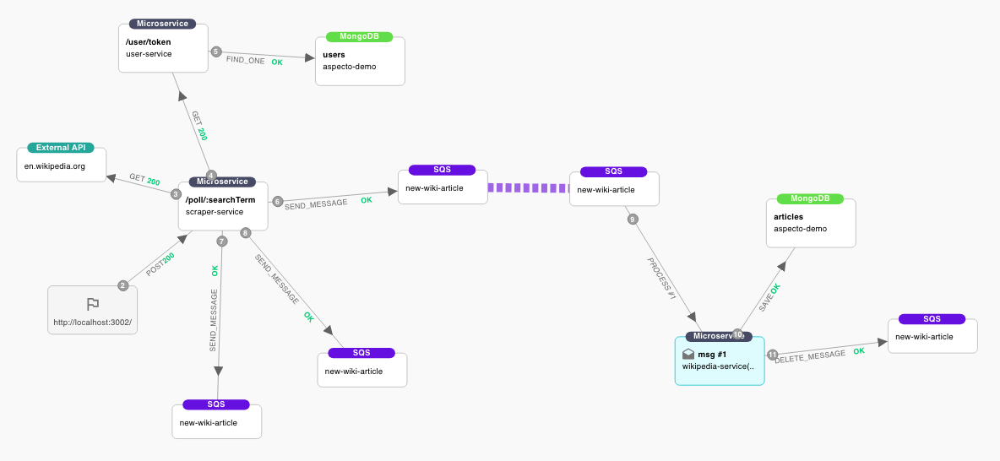
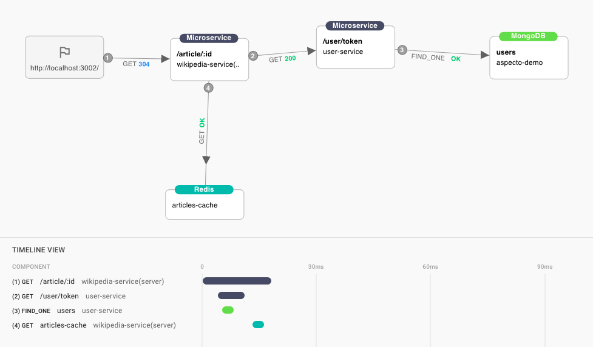
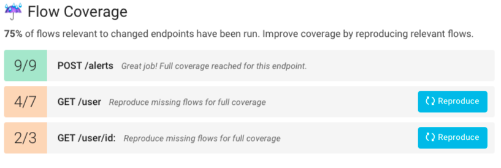
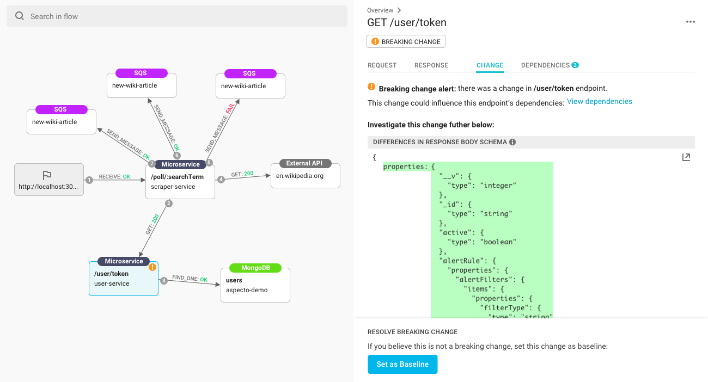
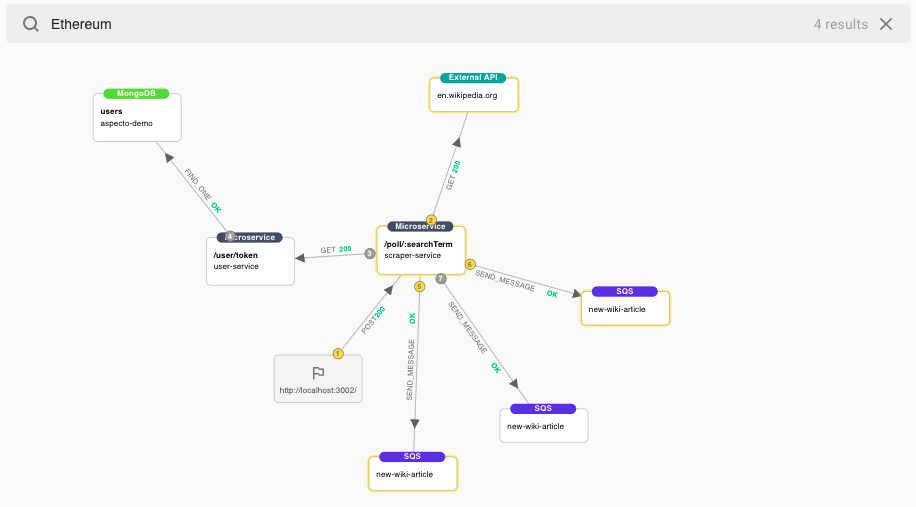
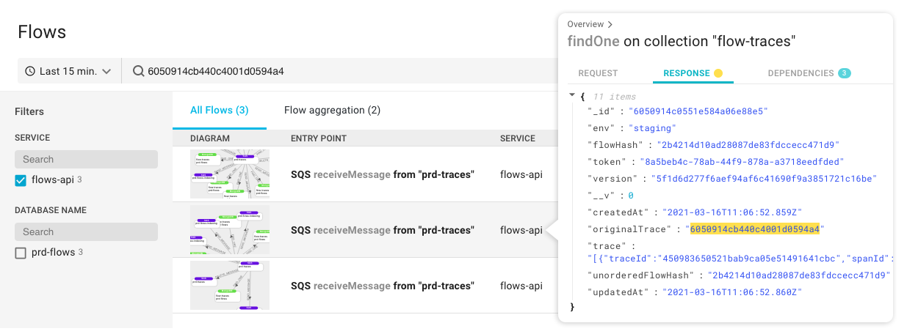
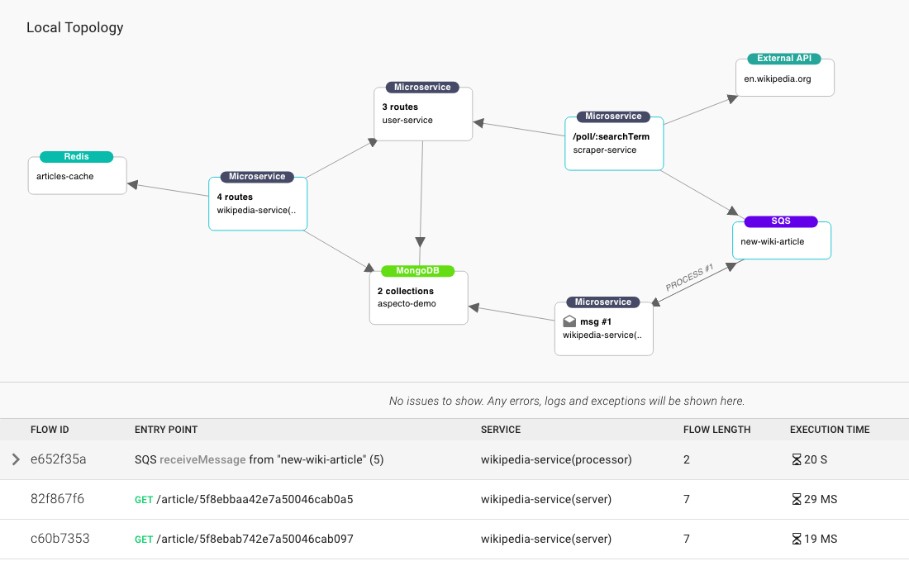

# What is Aspecto

Welcome to Aspecto! 👋  
  
Aspecto allows you to deeply understand and debug microservices as early as your local development environment - think 'Chrome Devtools' for microservices. It's designed for developers to understand issues quickly, develop faster, and prevent issues before they reach staging or production.

## 👁 Visualize Complex Flows

[The Aspecto diagram](visualize-data-flows.md) shows the relations between services, the order of activities in a flow, and provides a clear picture of the app's architecture. Aspecto also displays the entire route of any message sent through Kafka, RabbitMQ, SQS, and other sorts of message brokers.

## [📈](https://emojipedia.org/chart-increasing/) Optimize Performance

[The timeline](timing.md) displays the order of activities and displays how much time each activity took, making it easy to identify bottlenecks.

## ☔️ Ensure Test Coverage

[Merging branches in Github is now safer](prevent-issues-before-merging.md): Aspecto compares the current version to the previous one and checks which of the flows that ran in the previous version also ran in the current. Differences are displayed in the pull request. 

## 🦍  Detect Breaking Changes

By comparing flows run to the application baseline, Aspecto is able to [detect breaking changes](breaking-changes.md) between microservices.

## 🗺  Follow a Parameter's Journey

Any parameter that appears inside a flow can be easily found: where it started, which components passed it along, and where it ended. This journey is visually marked on the graph and can be inspected inside each component's payload. 

## 🔎  Troubleshoot Issues in Staging and Production

Aspecto collects all trace data including requests, queries, and different types of data, then correlates it to logs and metrics.   
  
Beyond traditional logs, Aspecto allows you to easily search payloads, DB queries, async messages, and more, without being dependant on developers inserting logs in the correct places.

## 👋  Help New Developers Onboard Easily

New developers that join the team can get familiar with the app by inspecting microservices interactions. Each flow can be viewed separately, or as a part of the entire local data architecture. This makes it much easier to grasp how each service works and interacts with other services in the app.

## See also



