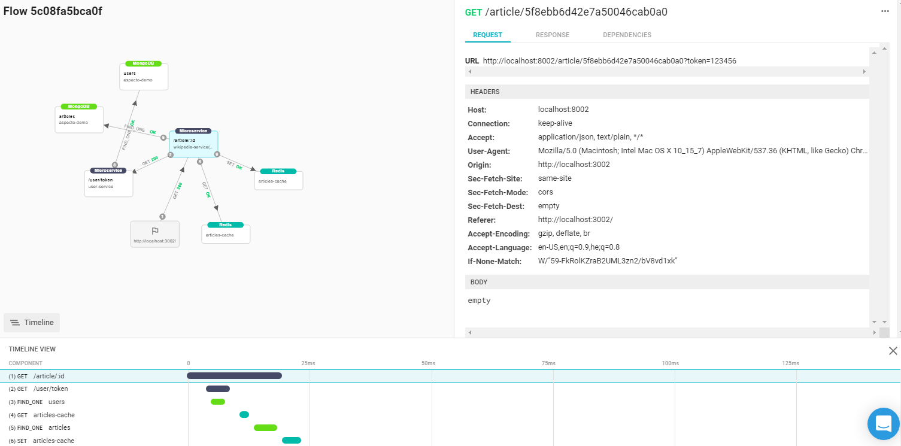
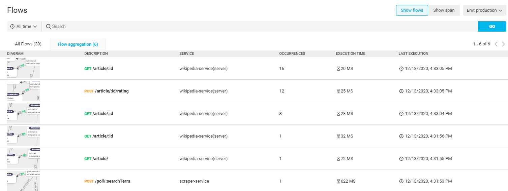
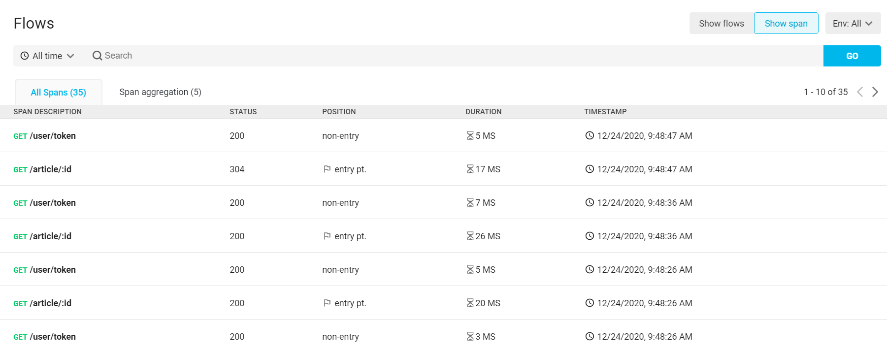
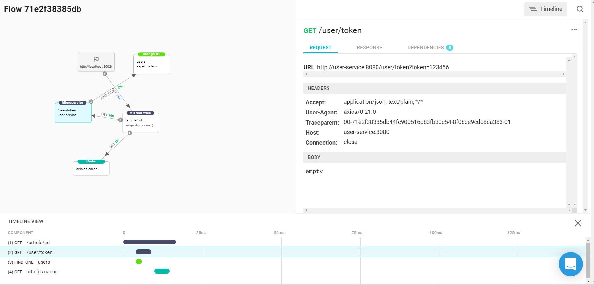

# Flow Search

You can view and analyze data flows in microservices deployed in development, staging, and production environments. This extends your ability to visualize the flows in your services beyond the Live Flows view of your local debugging environments, to mature environments. As in the Live Flow view, you can identify flows, analyze the data at each stage in the flow, see dependencies, and see the effects of changes.

## Getting Started

To view flows, follow [these steps](../install/#configuration) to instrument your application to send opentelemetry information to Aspecto. When activating, use {local:false}:

```javascript
require('@aspecto/opentelemetry')({ local: false });
```


## Search Flows

Select Flows Search in the main menu for the main page. This shows a list of all flows for which data has been collected. Data collection starts when the application is deployed after instrumentation.

You can search the list for specific flows. Include one or more search terms, separated by spaces. The results will show flows with a field matching at least one of the terms.

You can also see flows for a selected period of time. 


Select a flow from the list to see more detail for it. This shows the graph, detail, and timeline, that are described in the [Live Flow ](../live-debugging/visualize-data-flows/)section. You can examine nodes in the flow to see details of the data flow.



### Aggregate view

The Flow Aggregation tab shows the flows, aggregated \(grouped\) according to common flows. That is,  each unique flow appears in the list once,  with the number of occurrences of it shown. 



## Spans

You can also search and view flow information according to spans. This lists flows by their nodes. Details for the spans include the status of the flow into it \(for example the HTTP status\), the position of the span in the overall flow \(whether it is the entry point, or not\), and the time.



Select a span form the list to see the flow through it. This shows the graph, details for selected elements, and timeline information, as with the flow view.



You can also see an aggregate span view, in the **Span aggregation** tab, which groups flows through the same nodes.

