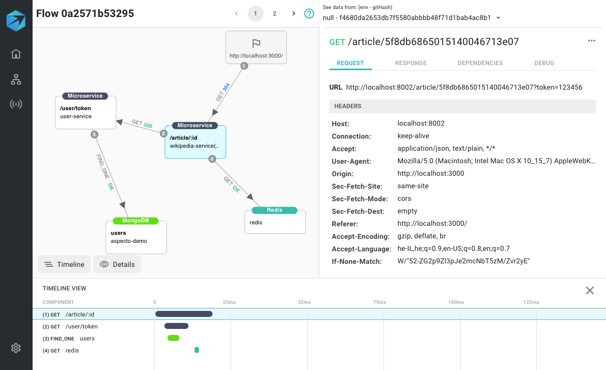

# Analyze Dependencies

The Live Flows view shows the flows from other services using the same endpoints as your services. These are in the **DEPENDENCIES** tab, grouped by service and endpoint.

Click on a flow in this list to open a Flow view for it.   
You can investigate the dependency in the same way as in live flows:


If there are no flows in the DEPENDENCIES tab, Aspecto might not be running on your service in a [deployed environment](deployed-environment/deployed-environment-set-up.md).


