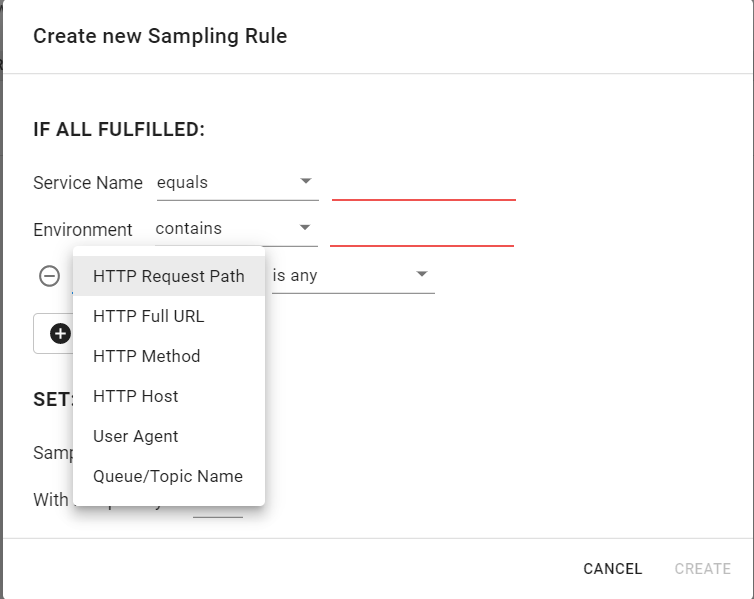

# Sampling Rules

When you initialize Aspecto in your service, you can pass the **`samplingRatio`** option, to control the general sampling rate of our client. Sometimes you want more sampling control only for specific flows. You can use sampling rules for this. Sampling rules set the rate \(for example, higher\) for specific flows.

## Create Sample Rules

Select [Sampling Rules](https://app.aspecto.io/app/settings/sampling-rules) on from the Settings menu in Aspecto, and click **New Rule**.

1. Select the Service and Environment, on which the rule applies. These are mandatory fields. For eacch, select \(from a list\) the matching condition for the name \(equals, contains, does not contain\), and  the name to match.  Select 'any' to match any \(all\) name or environment.
2. Optionally, add additional conditions, selected from a list, to match the specific flows for the rule. You can select an HTTP path, URL, method, and other conditions. For each selection, select the matching condition, and the text to match.   
   Examples of conditions:

   * HTTP Request Path \(e.g., `/api/users/5ffc067eb3fe9c9520611f34`\)
   * HTTP Full URL \(e.g.,`https://my.domain.com/api/users?page=6&size=10`\)
   * HTTP Method \(e.g., `GET`, `POST`, etc.\)
   * HTTP Host \(e.g., `my.domain.com`\)
   * User Agent \(e.g., `PostmanRuntime/7.2` \) 
   * Queue/Topic Name \(Queue name for SQS, Topic name for Kafka, etc.\)

  
   Add additional conditions as necessary, to refine the selection of flows for the rule.

1. Select the sampling rate for the rule.
2. Select the priority for the rule. Rules are run by priority, with highest priority 1. Once a rule applies to a flow, no other rules are applied to the same flow \(for example, with lower priority\). Use this to set prioritized sampling rates.
3. Click **CREATE** to add the rule. Rules are applied to matching flows in your environments immediately when created or modified.

In the above example, we created a rule to sample only 10% of _`health-check`_ requests, where the service name is `wikipedia-service`and the environment name begins with `prod`.  
  
**Important Notes**

* **All** rule conditions must be fulfilled for a rule to apply. 
* Rules are matched only against the **entry point** of a flow but affect the sampling of the entire flow. That means that if I set a rule where `HTTP Request Path equals "/user"` , and my flow starts with a request to an endpoint called `/account` , which internally calls the `/user` endpoint, the rule will not apply, even though the user endpoint was involved.  
* String-based rules are **case insensitive** \(i.e. `"HELLO" contains "he"` will match\) 
* SDK clients are updated in real-time and changes are **effective immediately**, so be careful! 
* Rules are run by their priority where **1 is the top priority.** Once a rule matches a flow, no other rules will be applied to the same flow. 
* If none of the rules match, the default sampling rate will be used \(using `samplingRate` ,or 100% if this isn't set\). 
* Sampling rules are ignored when running in local mode.

