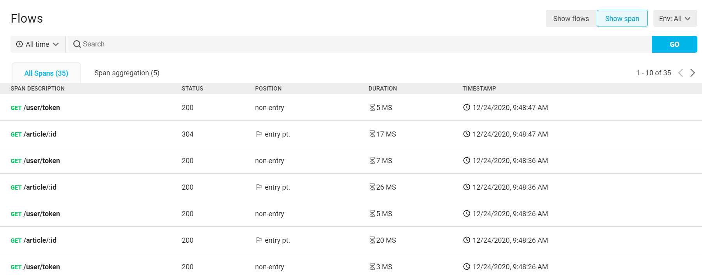
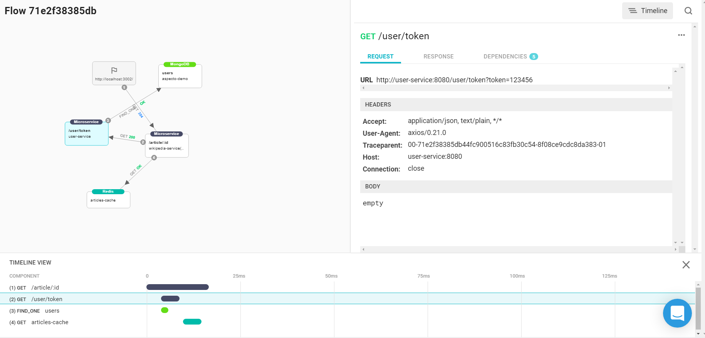

# Troubleshoot Production

Aspecto provides insightful tools that help you debug application issues that have reached your production environment.

## Flows Search

Select Flows Search in the main menu for the main page. This shows a list of all flows for which data has been collected. Data collection starts when the application is deployed after instrumentation.

You can search the list for specific flows. Include one or more search terms, separated by spaces. The results will show flows with a field matching at least one of the terms.

You can also see flows for a selected period of time. 

Select a flow from the list to see more detail for it. This shows the graph, detail, and timeline, that are described in the [Live Flows ](visualize-data-flows.md)section. You can examine nodes in the flow to see details of the data flow.

### Aggregate view

The Flow Aggregation tab shows the flows, aggregated \(grouped\) according to common flows. That is,  each unique flow appears in the list once,  with the number of occurrences of it shown. 

## Spans

You can also search and view flow information according to spans. This lists flows by their nodes. Details for the spans include the status of the flow into it \(for example the HTTP status\), the position of the span in the overall flow \(whether it is the entry point, or not\), and the time.

Select a span from the list to see the flow through it. This shows the graph, details for selected elements, and timeline information, as with the flow view.

You can also see an aggregate span view, in the span aggregation ****tab, which groups flows through the same nodes.

