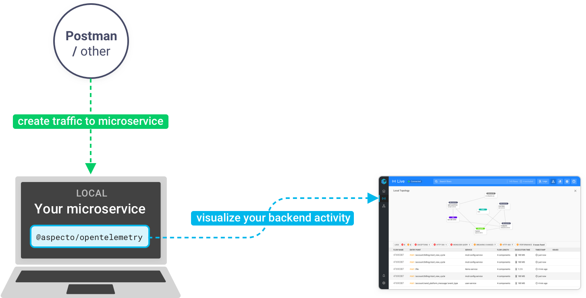

# Setup

Setting up is a simple process:

1. [Sign up for free](https://app.aspecto.io/user/login)
2. Install the SDK - a simple line of code
3. Start using Aspecto in your day to day development

Aspecto is a tool that you install on a Node.js microservice in your local environment.   
After installing the SDK, each time you create data on your microservice locally, this data will appear in Aspecto.

## 

