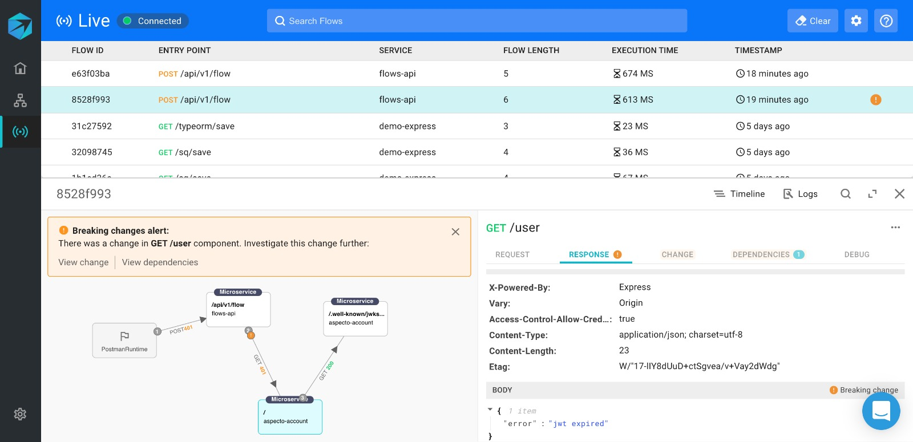
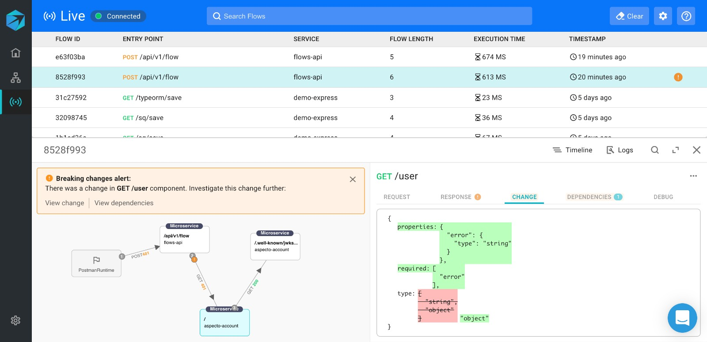
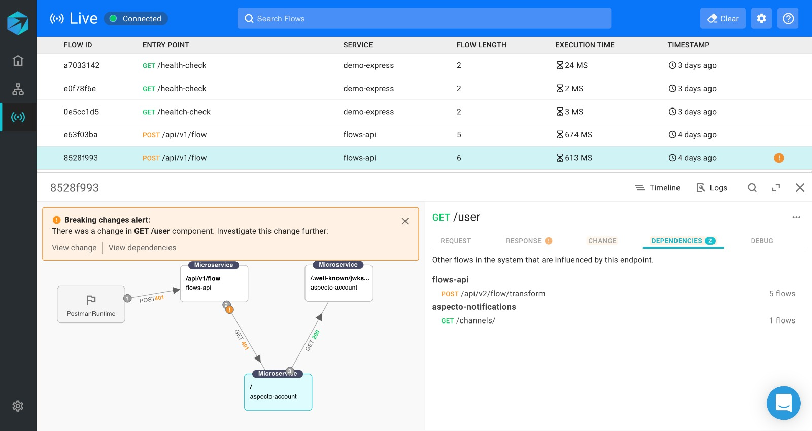

# Breaking Changes

The Live Flow view shows the effects that changes you make in endpoints have on other services using these endpoints.


If breaking changes never appear,  Aspecto might not be running on your service in a [deployed environment](../deployed-environment/deployed-environment-set-up.md).


When you make a change to an endpoint, a _Breaking changes alert_ is shown. This indicates that another flow, that uses the endpoint, is affected by the change, and may not function correctly as a result.

Click on _View change_ to see the response diff.

Click V_iew dependencies_ to see which other services use this endpoint, and are affected by the change. In the example, two additional services \(_flows-api_, and _aspecto-notifications_\), are affected by change, with several flows in each.   
Click on the services to investigate further the affected flows

