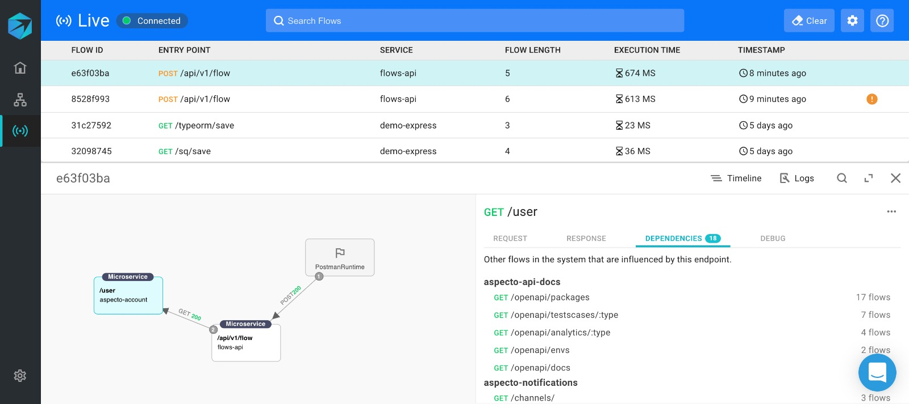
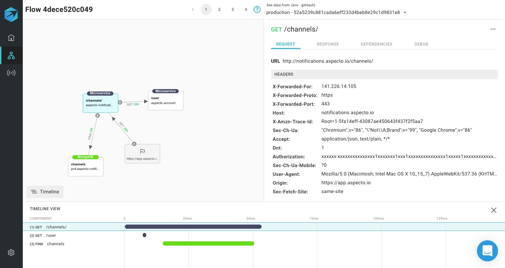

# Dependencies

The Live Flows view shows the flows from other services using the same endpoints as your services. These are in the DEPENDENCIES tab, grouped by service and endpoint.


If there are no flows in the DEPENDENCIES tab,  your service might not be running in a mature environment.


Click on a flow in this list to open a Live Flow view for it. You can investigate this flow in the same way as  in live flows:

 

