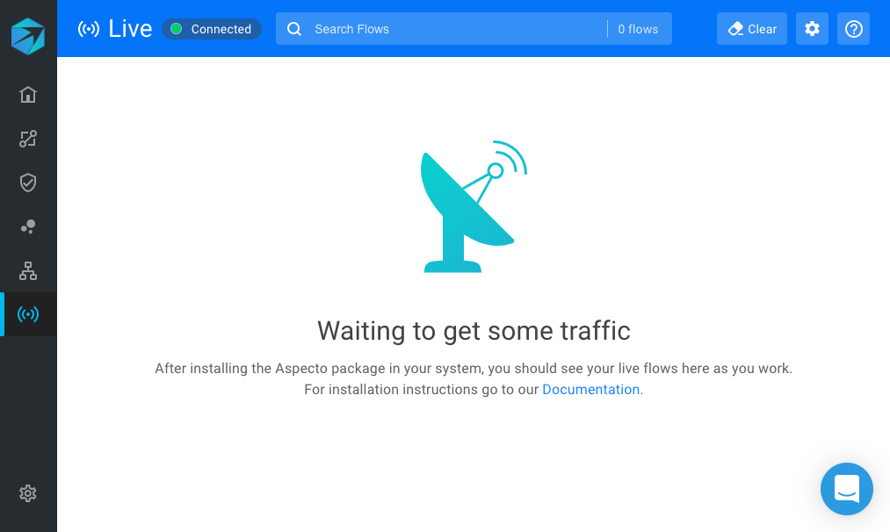
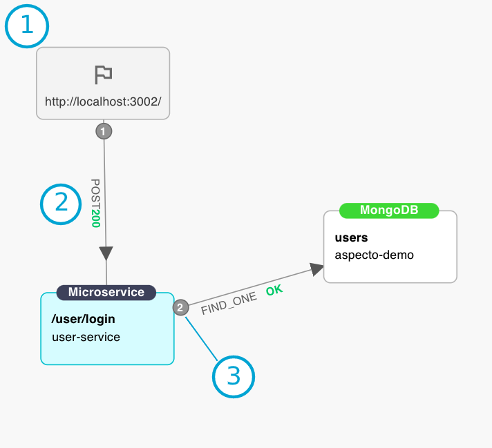

# Live Flows Overview

The Live Flow is a view of the data flows occurring in your services, starting with your **local traffic**. It shows in near **real-time** the flows through different endpoints and microservices, based on traffic you send it.

You can use this view to analyze the data flows, discover dependencies, and detect the effect of development changes.

## Getting started with Live Flow

To get started with Live Flow, follow [these steps ](../install/#configuration)to instrument your application for the telemetry that Aspecto uses. This securely sends information about live data flows to Aspecto, which is then shown in the Live Flow view.

Follow the [link](https://docs.aspecto.io/v1/install#connected-mode) shown in your terminal, to open the Live Flow in your browser.  
The initial view is waiting for live traffic to your service.

Now, send traffic to one or more endpoints in the instrumented service \(for example from Postman\).   
Our SDK will capture this and update the Live Flow view with the flows that were detected.

## Live Flow UI

The Live Flow view shows the  following:

**1** \(top\) - a list of the flows detected

**2** \(lower left\) - graph view of a selected flow  

**3** \(lower right\) - information view of a selected node in the graph

## Flows Table

The list of flows shows the service and **entry point** for the flow, and the time.

The list of flows is updated as new flows are detected by the telemetry sent from the service.  
New flows are shown **on top**.

## Graph

The graph view shows the services and endpoints involved in a flow. Here is a typical graph:

The graph has these elements:

**1** - Squares are nodes. There are different types, such as microservices, databases, and Lambda functions. The node label indicates the type of node, with more detail inside the node. The detail varies according to the type of node.

Nodes are the source or destination for an action. 

The entry node is shown with a flag, and a text showing the agent that make the request \(if applicable\):

**2** - Lines represent operations between nodes. This can be, for example, an HTTP request, or a database operation. The operation is labeled on the line, along with the status of the operation. The arrow indicates the direction of the action.

**3** - Numbers on lines represent the sequence of actions within the flow 

## Node information

The information view shows details for a node in the graph.   
This includes details for the incoming segment to the node in the data flow.   
In the example below, details for the node `/user/login` are shown.   
This includes the **REQUEST** and **RESPONSE**, other flows using the same endpoint \([Dependencies](dependencies.md)\), and the raw data of the span.

## Search

You can search for text that appears in the listed data flows. For example, you can search for specific field names, or for values, in either the request or response.   
All flows that match the search text are highlighted.

## Additional Views





### 

