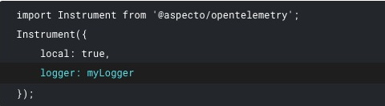

# Logging

You can use the Live Flow to examine the raw data at each stage of a flow. This can be a powerful debugging tool.

## Setup logging in your application

In order to see log information, you must instrument your application with a logger.  
Add a logger when initializing the Aspecto telemetry:

Then, configure your logger to collect logs for the levels you are interested in.

* Nir TODO: explain on set logger

## View flow log

In the Live Flow view for a data flow, select node in the flow \(in the graph\). Then, in the info pane on the right,  click _Logs._ The logs pane is opened, at the bottom. 

You can filter the view to show different log severities, on the left, or search for specific log records with a text search.

You can also expand each log to show more detail.

