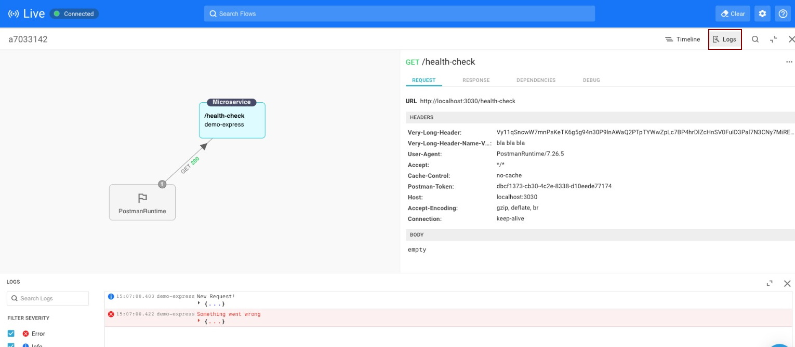
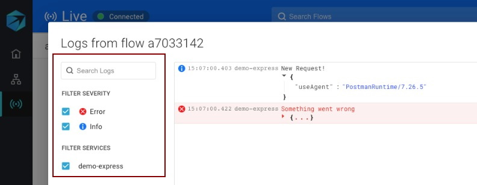
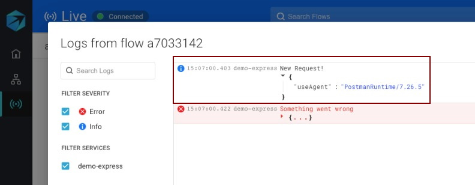

# Logging

You can use the Live Flow to examine the logs at each stage of a flow. This can be a powerful debugging tool.

## Setup logging in your application

In order to see log information, you must instrument your application with a logger.  
Add a logger when initializing the Aspecto telemetry:

```typescript
import Instrument from '@aspecto/opentelemetry';
Instrument({
    local: true,
    logger: myLogger
});
```

Then, configure your logger to collect logs for the levels you are interested in.  
If your logger is initialized or changed later in your service lifecycle, you can also set the logger after initializing Aspecto, like this:

```typescript
import Instrument from '@aspecto/opentelemetry';
const { setLogger } = Instrument({ local: true });

 // initialize your service ...
 setLogger(myLogger); 
```

## View flow log

In the Live Flow, in the info pane on the right, click _Logs._ The Logs pane will open at the bottom. 



On the left, You can filter the view to show different log **severities**, filter by **service name**, or **search** for specific log records with a text search.



You can also **expand** each log to show more detail.




