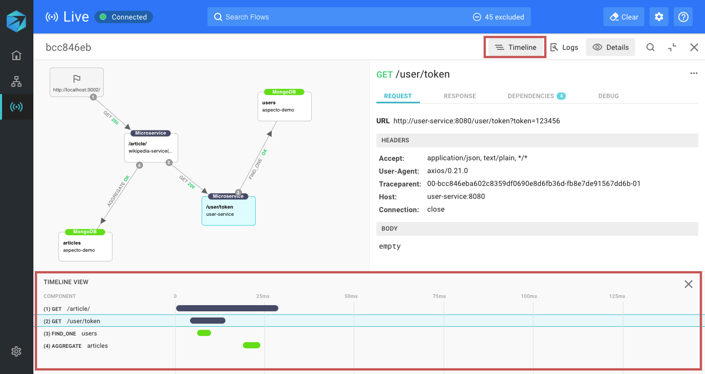

# Timeline

Use the Live Flow to see the exact **timing** of a data flow.   
This can give you insights into delays and possible **bottlenecks** in your applications and their flows.

Once you have selected a flow to investigate, click _Timeline_ in the information pane on the right.

The timeline for the flow is shown below, with the selected node highlighted.

