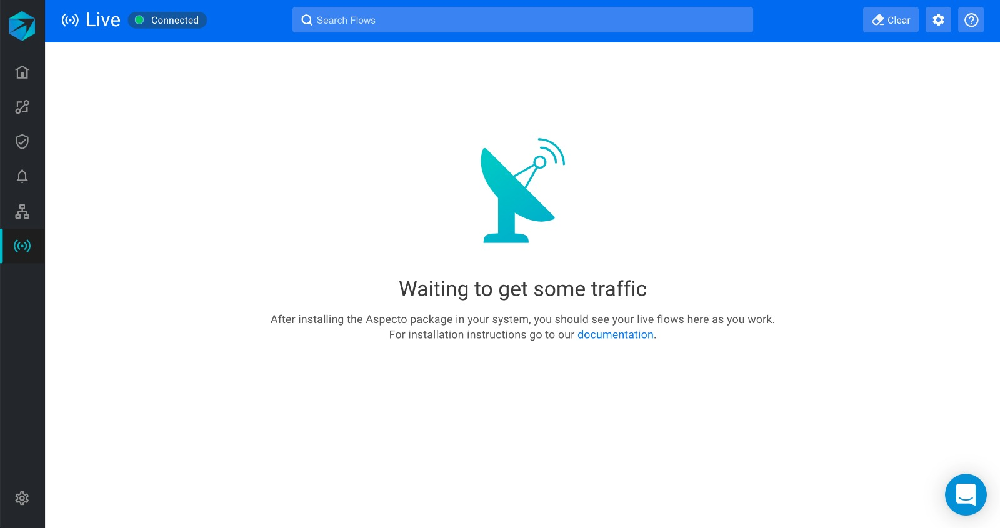
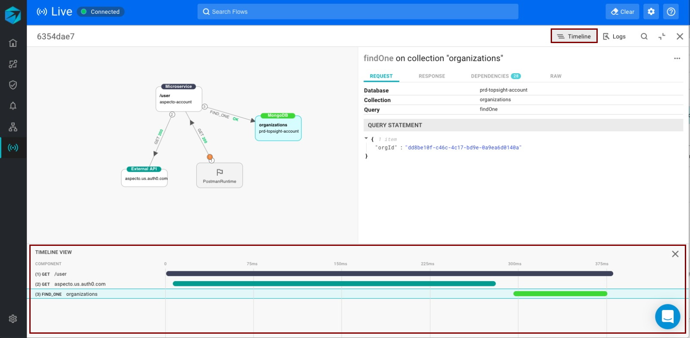
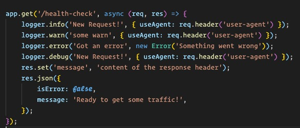

# Getting Started

The Live Flow is a view of the data flows occurring in your services. It shows in near real-time the flows through different endpoints and microservices, based on traffic you send it.

You can use this view to analyze the data flows, discover dependencies, and detect the effect of development changes.

## Getting started with Live Flow

To get started with Live Flow, follow [these steps ](../configure.md#configuration)to instrument your application for the telemetry that Aspecto uses. This securely sends information about live data flows to Aspecto, which is shown in the Live Flow.

Follow the link shown in your DevOps tool, to open the Live Flow in your browser.

The initial view is waiting for live traffic to your service.

Now, send traffic to one or more endpoints in the service \(for example from Postman\). The telemetry instrumented in your service will capture this and update the Live Flow view with the flows that were detected.

## Live Flow UI

The Live Flow view shows the  following:

**1** \(top\) - a list of the flows detected

**2** \(lower left\) - graph view of a selected flow  

**3** \(lower right\) - information view of a selected node in the graph

## Flows

The list of flows shows the service and entry point for the flow, the time, and the number of nodes involved.

The list of flows is updated as new flows are detected by the telemetry sent from the service.

## Graph

The graph view shows the services and endpoints involved in a flow.

## Node information

The information view shows details for a node in the graph. This includes details for the message in the data flow \(request, response\).

There are also the following additional options in the  information view

### Timeline

The timeline shows the data flow elements along a timeline, which shows the sequence of flows and the exact times for each.

### Logs

The Logs view shows log messages recorded by the service. Logging requires the service to implement logging. 

## Search

You can search for text that appears in the listed data flows. For example, you can search for specific field names, or for values, in either the request or response. All flows that match the search text are highlighted.

## Settings

### Group flows

You can group flows that are similar, to declutter the list of flows. 

### Exclude & include

You can exclude specific flows from the Live Flow list. Use this to declutter the list by hiding flows that are not interesting to you.

Excluded flows are not gone.  You can remove the exclusion so that they reappear in the flow list.

