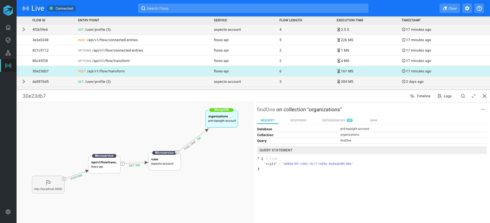

# Visualize data flows

Aspecto collects information on all data flows in your services. You view these flows on the Live Flow view.

Use this view to see details for all the data flows in your services, to help in debugging and troubleshooting your application, before deploying it to a production environment. 

For each flow,  you can see the steps in the flow, starting with the initial endpoint. At each step, you can see the service or microservice, the endpoint involved, and details of the request and response.

The example below shows a data flow, starting with an API request, and ending with a database operation.

 Click on the first stop in the flow \(highlighted in blue\), and see details of the request and response on the right.

Follow the flow to the next node.

Finally, the last step in the flow is the action on the MongoDB database, in this case a query. The query text is  shown on the right.

