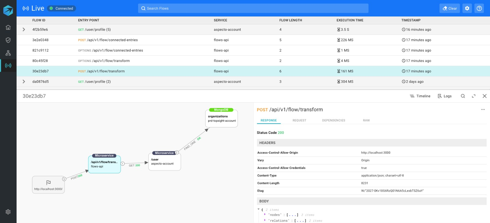
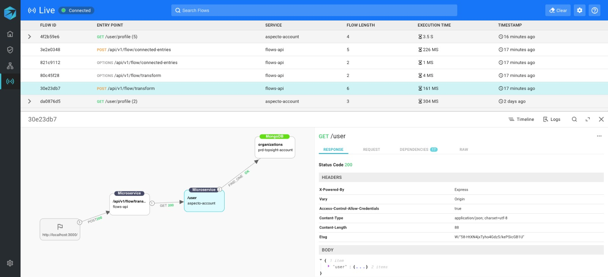

# Flow Visualization

Aspecto collects information on all data flows in your services. You view these flows on the Live Flow view.

Use this view to see details for all the data flows in your services, to help in debugging and troubleshooting your application, before deploying it to a production environment. 

For each flow,  you can see the steps in the flow, starting with the initial endpoint. At each step, you can see the microservice, the endpoint involved, and extra details.

The example below shows a data flow, starting with an API request, traversing to a different microservice, and involving a database operation.

 Click on the first stop in the flow \(highlighted in blue\), and see details of the request and response on the right.

To visualize the next part of the flow, click on the next node in the chain.  
In this case, the next node is in a different microservice.

Finally, the last step in the flow is the action on the MongoDB database, in this case, a query.   
The query text, along with other relevant data, is shown on the right.

The Live Flow visualization gives you visibility into the following:

* how requests flow between different services
* the data that flows between services

The sections below explain how to use these Live Flow features

* view timelines see the timing of each stage of a flow
* view logs to see raw data at various stages
* view the flow into and through 3rd-party APIs and libraries

