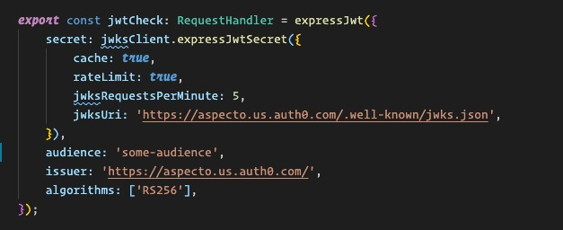
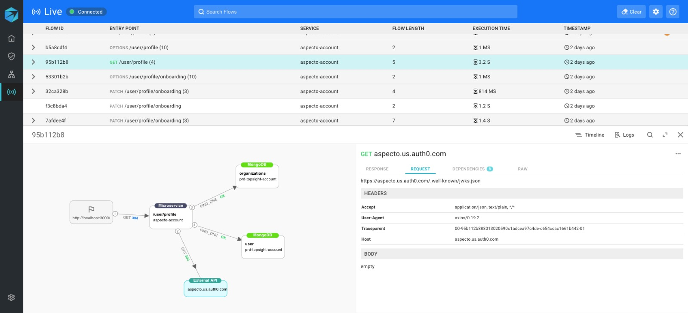

# Visualize 3rd-party APIs

Using the information collected by Aspecto, you can follow data flows into third-party libraries, so you no longer have opaque paths.  This can be a powerful debugging tool, to help you understand how calls to these libraries interact with your data. 

In the code snippet example below, a third-party library function is invoked \(expressJwtSecret\).

In the Live Flow, you can see how this call is translated into a  data flow, with a specific endpoint.

## Supported libraries

These Node.js libraries have been instrumented for Aspecto, to provide data flow information:

* mongoose
* aws-sdk 
* kafka-node 
* kafkajs 
* express 
* typeorm 
* http 
* ioredis
* sequelize

