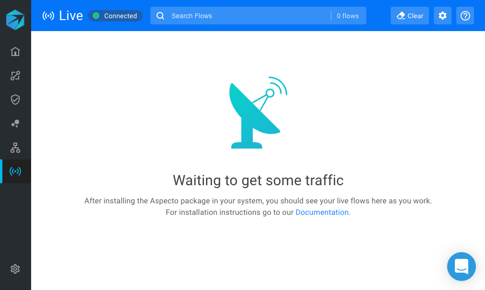

# Overview

Aspecto 'Live Flows' shows real-time traces, or flows, through different endpoints and microservices based on the local traffic you send it. You can use this to analyze your flows, view microservice dependencies, and understand how a code change affected your microservices.  
  
This is a powerful way to proactively develop and debug your application, preventing issues from reaching production.

## Getting Started

After installing the SDK, follow the [link](getting-started/install/install-the-sdk.md) shown in your terminal to open Live Flows in your browser. The initial view is waiting for live traffic from your service.

Now, to see some flows, send some traffic to an endpoint in your service. For example, send an HTTP request from Postman to your service.   
  
You should then see a list of flows, and after selecting one, you should see a screen like this:

What you see in this layout is:

**1** List of the flows that your service generated

**2** The diagram of the selected flow

**3** The selected component's info

### 

