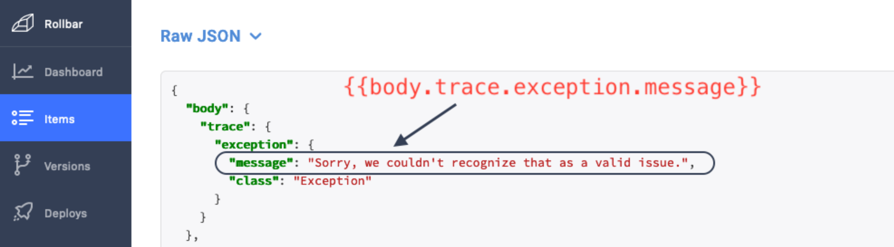
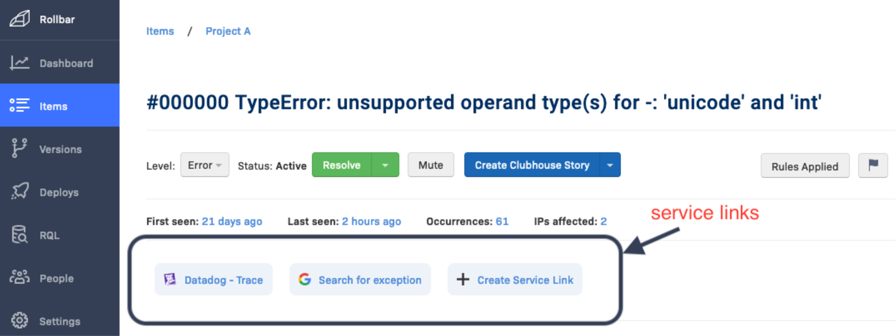

# Rollbar

Rollbar is not the “last stop” for monitoring and debugging - often you might also be interested in what your other monitoring and performance tools are telling you. Those tools were a few clicks and copy-pastes away - **now with Service Links they are just 1 click away.**

## Enrich Your Logs With Telemetry Data

To search for the logs related to a specific trace or the request transaction which generated the trace, you’ll need to enrich your logs with the trace ID and span ID. These log fields will let you drill down via a link that opens the specific trace in Aspecto from within Logz.io.

The enrichment process depends on the language and log type. You can find [here](../../../send-tracing-data-to-aspecto/aspecto-sdk/nodejs/customize-defaults/logs-correlation.md) example how to add it using Aspecto SDK.

## Creating a Service Link **to Aspecto**

Configuration is per-project in Rollbar.

1\. In Rollbar, navigate to **Projects** and select the project you want to create a Service Link in**.**

2\. In the left-side navigation, click **Service Links→ Create a Service Link.**

3\. Create a link to Aspecto in the text area. You can add **dynamic payload data** to a service link, by using the **raw JSON** you send to Rollbar. This data is accessible via **JSON dot notation** - surround the parameters with **\{{ \}}**. If you want to access an index in a list of objects, you can do so like this: \`my\_var.some\_list\[2].



For example:&#x20;

```
https://app.aspecto.io/app/traces/{{custom.trace_id}}
```

4\. Name the link, then click **Save.**

5\. Service Links will now show up on the item detail page.\



