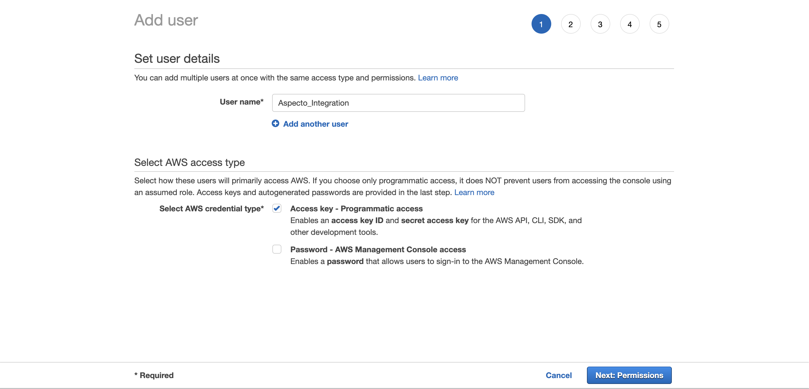

# Amazon OpenSearch

If you’re manage you logs within Amazon OpenSearch, you can correlate logs with their corresponding traces in Aspecto.

## Enrich Your Logs With Telemetry Data

To search for the logs related to a specific trace or the request transaction which generated the trace, you’ll need to enrich your logs with the trace ID and span ID. These log fields will let you drill down via a link that opens the specific trace in Aspecto from within Amazon OpenSearch.

The enrichment process depends on the language and log type. You can find [here](../../../send-tracing-data-to-aspecto/aspecto-sdk/nodejs/customize-defaults/logs-correlation.md) example how to add it using Aspecto SDK.

## View logs from Trace within Aspecto 

This integration allows you access and view your logs within Aspecto. It easily enables navigate from a trace to its correlated logs.

Integrate once, and start viewing your logs from the trace viewer . Here's how to integrate:

1\. Log into your **AWS** account as an administrator.

2\. Navigate to **IAM** > **Access management** > **Users**_._

3\. Add a new user with **Access key - Programmatic access**.

<figure><figcaption></figcaption></figure>

4\. Give the user read-only permissions for your OpenSearch instance (**es:ESHttpPost** and **es:ESHttpGet**). \
Learn more about [Access Management in Amazon OpenSearch Service](https://docs.aws.amazon.com/opensearch-service/latest/developerguide/ac.html).

5\. Enter the user's **Access key ID**.

<figure><figcaption></figcaption></figure>

6\. Enter the user's **Secret access key**.

7\. Enter your AWS OpenSerach **Region**, following the next table [here](https://docs.aws.amazon.com/AmazonRDS/latest/UserGuide/Concepts.RegionsAndAvailabilityZones.html#Concepts.RegionsAndAvailabilityZones.Regions) (e.g. `eu-west-1`).

8\. Enter your AWS OpenSearch **Domain endpoint** (e.g. `https://search-playground-fyogs14nrka2bcz9a.eu-west-1.es.amazonaws.com`).

9\. Enter the **trace ID** field name as you saved it in your logs (can be multiple fields, e.g. `traceId` if the field saved in the first level, or `metadta.trace-id` if the field name is `trace-id` within object called `metadta`).

Once you complete the Integration, You will be able to view your logs correlated to specific trace (if exist) from the trace viewer.

