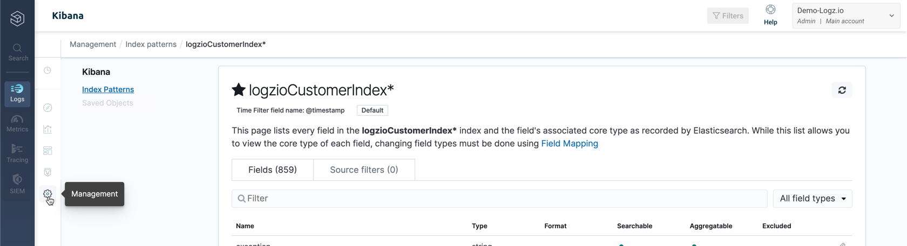
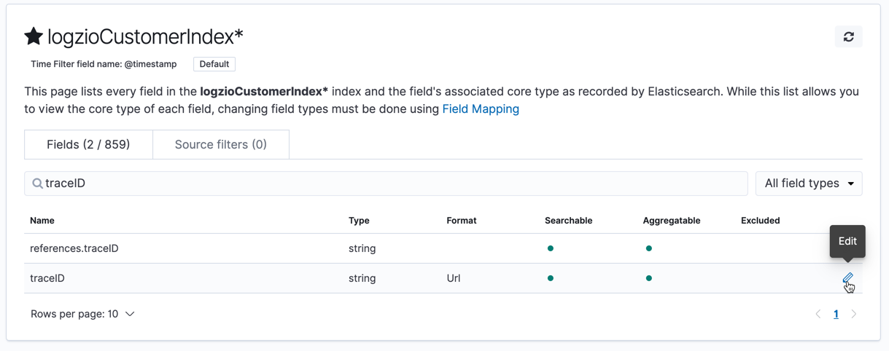
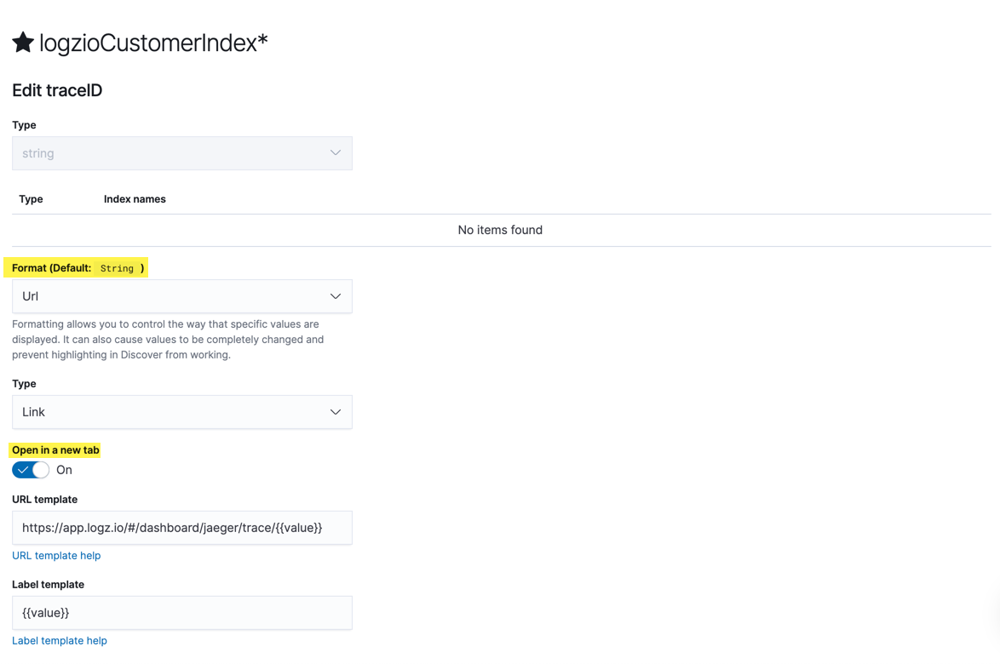

# Logz.io

If you’re manage you logs within Logz.io, you can correlate logs with their corresponding traces and spans in Aspecto.

## Enrich Your Logs With Telemetry Data

To search for the logs related to a specific trace or the request transaction which generated the trace, you’ll need to enrich your logs with the trace ID and span ID. These log fields will let you drill down via a link that opens the specific trace in Aspecto from within Logz.io.

The enrichment process depends on the language and log type. You can find [here](../../../send-tracing-data-to-aspecto/aspecto-sdk/nodejs/customize-defaults/logs-correlation.md) example how to add it using Aspecto SDK.

## View logs from Trace within Aspecto 

This integration allows you access and view your logs within Aspecto. It easily enables navigate from a trace to its correlated logs.

Integrate once, and start viewing your logs from the trace viewer . Here's how to integrate:

1\. Log into your **Logz.io** account as an admin.

2\. Navigate to **Settings** > **Manage tokens** > **API tokens** tab.

3\. To create an API token, click **+ New API token**. Type a brief token name and click **Add**.

4\. Enter your API token.

5\. Enter your **API host** following the next table [here](https://docs.logz.io/user-guide/accounts/account-region.html#available-regions) (e.g. `https://api.logz.io`). You can find your account’s region by selecting **Settings** > **General** from the top menu.&#x20;

6\. Enter the **trace ID** field name as you saved it in your logs (can be multiple fields, e.g. `traceId` if the field saved in the first level, or `metadta.trace-id` if the field name is `trace-id` within object called `metadta`).

7\. Enter the **span ID** field name as you saved it in your logs (can be multiple fields, e.g. `spanId`).

8\. Click on **Integrate.**

Once you complete the Integration, You will be able to view your logs correlated to specific trace (if exist) from the trace viewer.

## View Trace in Aspecto from Logz.io Log 

1. Once the trace ID is part of the log attributes, open the Kibana left menu, and select **Management**.
2. To manage log index patterns, click **Index pattern** and go to your default index pattern settings.

3\. Search for the trace ID field you want to correlate with your logs and select **Edit**. In this example, the field name is **traceID**.

4\. Change the **Format** to **URL** and enable **Open in a new tab**.

5\. Using your main account, insert the following template in the **URL template** field of the trace in Aspecto, and **Save field**.

`https://app.aspecto.io/app/traces/{{value}}`

Each traceID attribute functions as a drill down link that leads you to the correlated trace view in Aspecto.\
