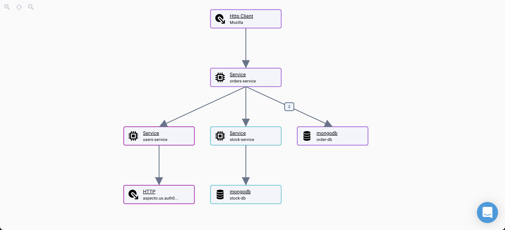
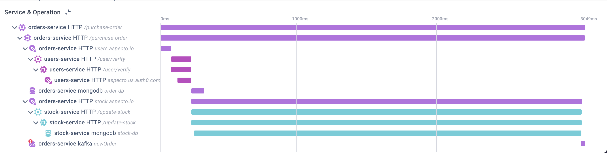

# Investigate Your Tracing Data

## Overview&#x20;

Using the Trace Search tool, filter and sort through your trace data to find performance bottlenecks, errors, exceptions and application issues that have reached your production environment.&#x20;

Once you've searched through and easily pinpointed where the problem lies, click on the trace to further investigate and understand why the problem exists.&#x20;

## Search &#x20;

Select the **Trace Search** icon to view a list of every trace that has been collected. Each row represents a trace - actions that took place in your system.&#x20;


Data collection starts when the application is deployed after instrumentation. For more information on how to deploy the Aspecto SDK, [click here](https://docs.aspecto.io/v1/send-tracing-data-to-aspecto/aspecto-sdk).&#x20;


.png>)

#### Filter&#x20;

Use the filters in the search bar to locate a specific trace to view more information on the endpoint-to-endpoint transaction. You can filter your search using the open search field or by:

| Filter Name      | Description                                                                                                                                             |
| ---------------- | ------------------------------------------------------------------------------------------------------------------------------------------------------- |
| time frame       | The starting and ending period in which the traces was performed                                                                                        |
| severity         | Whether the trace threw an error or exception or HTTP 5XX                                                                                               |
| service          | The name of the microservice. [How to configure it](../../send-tracing-data-to-aspecto/aspecto-sdk/nodejs/customize-defaults/advanced.md#configuration) |
| environment      | The name of the environment. [How to configure it](../../send-tracing-data-to-aspecto/aspecto-sdk/nodejs/customize-defaults/advanced.md#configuration)  |
| HTTP Method      | The HTTP method (GET, POST, etc..)                                                                                                                      |
| HTTP Status code | The HTTP status code - 200,500 etc..                                                                                                                    |
| route            | A specific endpoint request (/api/v1/users)                                                                                                             |
| database name    | The name of the relevant database component                                                                                                             |
| AWS service      | The name of the Amazon service (S3, SQS, kinesis)                                                                                                       |
| queue            | The name of the queue (sqs queue name, kafka topic )                                                                                                    |
| functions        | A severless function, such as an AWS Lambda function                                                                                                    |

Feel free to use more than one search parameter to really define what you're looking for. For example, perhaps you are searching for a failed HTTP request to POST `/v1/example`.  Simply filter the HTTP method to only POST requests, filter the route to `/v1/example`, and filter the status code to 500. The search results will display every POST `/v1/example` request that failed due to 500 within the selected time frame.&#x20;

You can also refine your search using the displayed graph above the list of traces. The x-axis represents the execution time for each trace and the y-axis represents the function. By clicking on **function** or **group by**, you can alternate what the y-axis represents and can aggregate traces together in order to view how traces change over time. Once you've set the function, highlight over a specific section of the graph. The trace list will then only display traces that fall within that specific region.&#x20;

#### Sort

Now that you've filtered your search and have narrowed down the list of traces, you can sort through the remaining traces by clicking on any column header. The traces will automatically sort from ascending to descending but you can change the order of the sort using the arrow that appears next to the column name.&#x20;

## Observe&#x20;

From the refined list, select the specific trace or set of aggregated traces you've been searching for in order to view more information.&#x20;

Three main sections will appear:

* Summary
* Diagram
* Timeline

### Summary&#x20;

The summary states the services that rely on the specific components within the trace, what the execution time was of the trace (AKA how long it took to perform), and the longest operation.&#x20;

If any component within the trace failed or did not perform as it should, you can click on that component within the diagram or the timeline and the summary section will populate with information as to why. You can also click on the error icon itself to view more information.&#x20;

### Diagram&#x20;

The diagram section allows you the visualize the relationship between services, understand the order of activities in a trace, and provides a clear picture of the application's architecture. On a high level, it will showcase how related operations across multiple microservices connect with each other in a single trace and will display the entire route of any message sent through Kafka, RabbitMQ, SQS, and other sorts of message brokers.&#x20;

To further understand what took place in each step, simply click on the relevant component and information pertaining to the request, response, dependencies, and (occasionally) exceptions will appear. &#x20;

**Request:** information pertaining to the component that you sent data to.

**Response:** the data that was sent in the request (a response to the request).&#x20;

**Dependencies:** a list of other traces in your distributed system that use the selected component.&#x20;

**Exceptions:** this section appears whenever a component through an exception. The captured exception will display, including the exception message and the stack trace.&#x20;

If any part of the trace failed, an exclamation icon (!) appear to catch your attention. The same icon will appear in orange/ yellow if an exception occurred or a component passed but not necessarily as it should.&#x20;

### Timeline&#x20;

The timeline showcases the hierarchy between components and displays the order in which every activity was performed, including how long it took. It makes it easy to visually identify bottlenecks and operational delays that result in performance issues within your application.

The component list on the left states the order and sequence of operations while the graph on the right showcases how many milliseconds each operation took.&#x20;

Selecting any bar on the graph will highlight the matching step in the diagram and will also display the details of the component, like the request, response, and dependencies.&#x20;

## What's Next?

Now that you've easily pinpointed the bottlenecks and anomalies in your distributed system, the next step is to reproduce the problem locally, debug, and troubleshoot!&#x20;

You can also dive deeper into our Trace Search tool for specific use cases, including searching for specific errors and exceptions or performance issues.&#x20;

