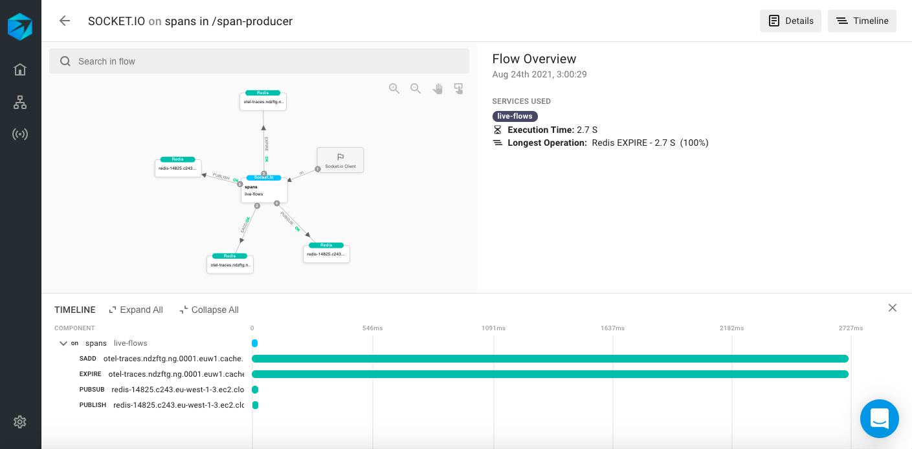
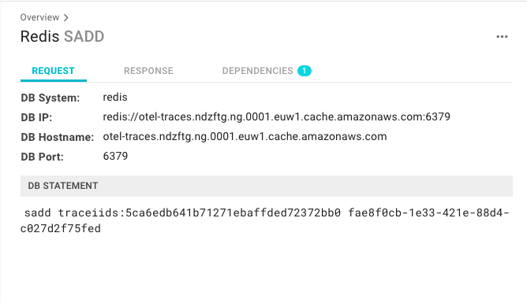

# Search for Performance Issues

Performance issues almost always lead to customer frustration and dissatisfaction, especially when your application isn't performing as it should or it is too slow. The Trace Search tool can be used to easily locate these performance issues within your distributed system and pinpoint exactly what component is causing the delay or extended execution time. 

In this guide, we'll go over how to use Trace Search to find time-related performance issues and how you can use the Aspecto diagram and Timeline hierarchy to define the exact component that's causing the delay. 

The entire process can be completed in 2 steps:

1. Locate the trace
2. Pinpoint the problem 

### Step 1: Locate the Trace 

1. Navigate to the **Trace Search** tab to view every monitored trace in your system. 

2\. Determine the time frame for your search. For example, if you'd like to review actions that took place within the last 24 hours, set the time frame to **Today**. 

.png>)

3\. Sort the traces by execution time by clicking on the **Execution Time** column title. 

You will now see a complete list of traces from the last 24 hours, displayed from longest  to shortest execution time. You can continue to refine your search as well using the parameters available on the left-side pane. 

You can also refine your search using the displayed graph above the list of traces. The x-axis represents the execution time for each trace and the y-axis represents the function. By clicking on **function** or **group by**, you can alternate what the y-axis represents and can aggregate traces together in order to view more information. 

4\. Select the very first row displayed in the list. This trace took the longest to complete. 

Once you've selected the trace, you can begin to further investigate why it took so long to perform. 

### Step 2: Pinpoint the Problem 

There are 3 main sections you can utilize to further investigate why a specific action takes so long to perform: summary, diagram, and timeline. 

While the summary and diagram provide excellent insight on the trace and how different components rely and communicate with each other, the timeline section really digs deep into how long each component in the trace took to perform. 

Taking the image above as an example, the timeline pinpointed exactly which components took much longer to perform than the rest. You can click on the component itself within the timeline to understand why this was the case. 

Once you've selected the component, the request, response, and dependencies will appear. You can now verify and check to see if something is wrong in the request, causing the response time to delay. 

###
