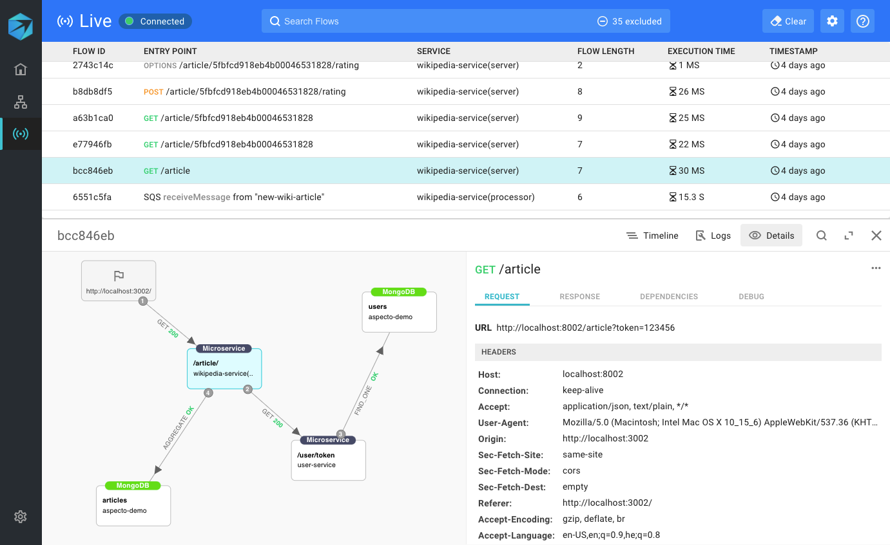
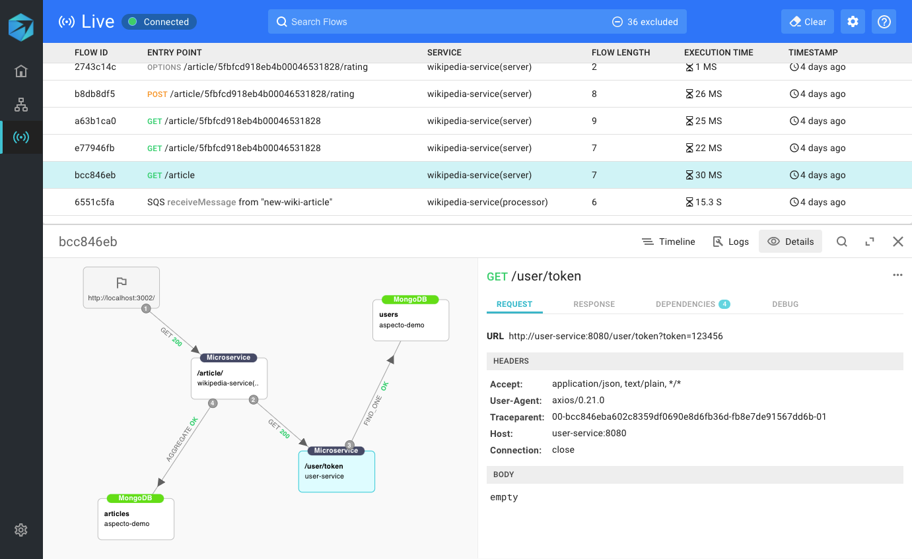
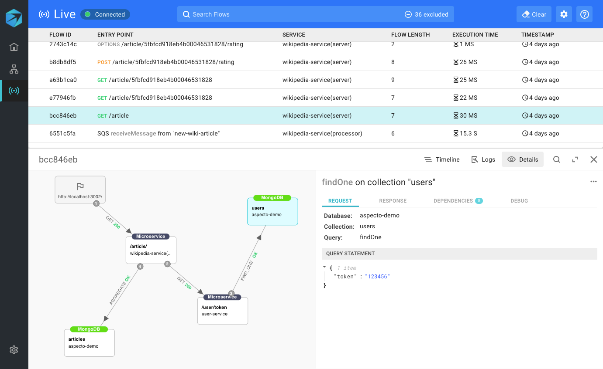

# Troubleshoot in Your Local Environment

Visualizing your application's traces is a powerful way to deeply understand and debug your microservices. 

Using the Aspecto Live Traces tool, easily view real-time traces, through different endpoints and microservices based on the local traffic you choose to send. You can use this tool to analyze your traces, view microservice dependencies, and understand how a code change affected your distributed system.

For example, let's take a look at the trace below. It begins with (1) an API request to the 'wikipedia-service' microservice, (2) then it calls the 'user-service', (3) and finally, it saves data to the MongoDB database.

Clicking on any component within the trace, such as the 'wikipedia-service' component, will display details of the HTTP request and response on the right. 

To understand the second part of the trace, we'll click on the next component, 'user-service'.

The last step in the trace is an action on the MongoDB database, which in this case is a `findOne` operation. The query, along with other relevant data, such as the DB response, is shown on the right.

## Getting Started with Live Traces 

After you've installed the Aspecto SDK across your distributed system, send traffic to an endpoint in your service. (For example, send an HTTP request from Postman to your service.)

.png>)

Once traffic begins to trace you will see a list of all your traces displayed directly within the Aspecto Live Trace tool. Simply click on any row to analyze the relevant trace. 

.png>)

**1 **List of the traces that your service generated

**2 **The diagram of the selected trace

**3 **Information pertaining to the selected component

