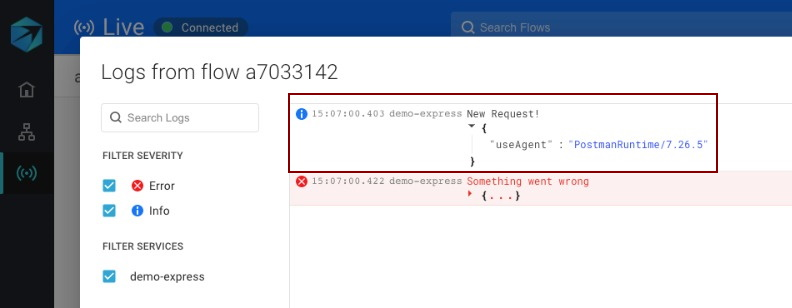

# Analyze Logs within a Flow

After [configuring your logs in Aspecto](../../send-tracing-data-to-aspecto/aspecto-sdk/customize-defaults/configure-logs.md), you can use the Live Flow tool to examine the logs of each stage in a trace. Logs are associated with a trace's diagram, giving you context of what you're looking at when searching your logs.

In the info pane on the right, click _Logs._ The Logs pane will open at the bottom. 

From the left-side pane, you can filter the view to show different log severities, filter by service name, or search for specific log records using the text search.

You can also expand each log to show more detail.

