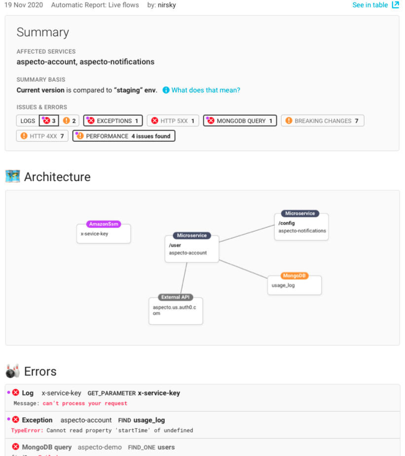

# Github Report

The Pull Request report includes insights that help you identify issues _before_ merging to your main branch. After integrating to Github, Aspecto provides a detailed report on the changes you've made to your service.  
  
The report includes:

* Different types of errors from logs and traces
* Performance issues
* New Flows that have been added to your system as a result of your changes
* Potential breaking changes that have been made
* How much coverage you have on your application's flows, and more 

