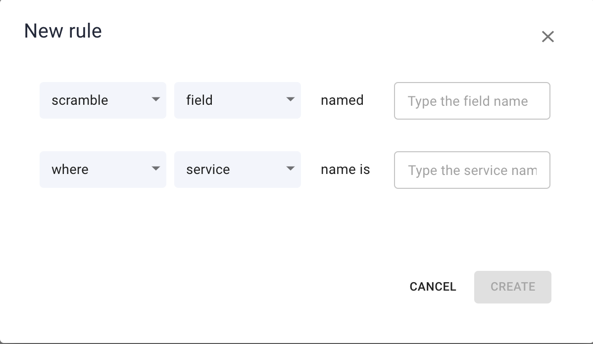
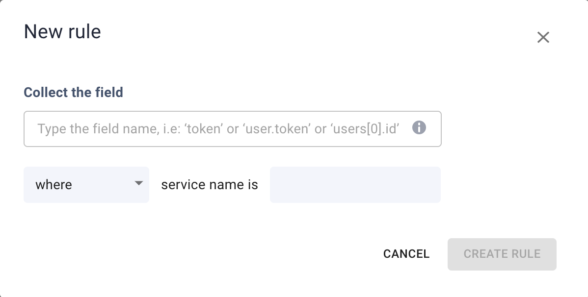

# Data Privacy

You can configure a Data Privacy policy on Aspecto to **keep your sensitive data private**, while Aspecto collects information from your applications.

In this policy, you can create privacy rules that allow you to hide specific data fields involved in traces, or data from a specific route.

## Data Privacy Rules

For fields, you can set a rule to **block** the field, so it is not collected in Aspecto telemetry data and is not shown in Aspecto visualizations (and cannot then be used as search text). \
Or, you can include the field, but **obfuscate** (scramble) the field data. For example, a key or user name can appear in the Live Traces,  but the actual data would be obfuscated.

For routes, you can set a rule to block telemetry data collection for a specific route anywhere or in a specific service. Any span containing the route will not include telemetry data, and will not appear in Live Flows.

## Create a rule

Click _Settings_, in the lower left of the Aspecto app, and then select _Data Privacy_. The rules you have created are listed. You can search for specific rule based on text in the rule (for example the name of a field or segment).

There are two different modes when creating privacy rules:

### Collect Payload (block-list)

This option means **all payload will be collected** across all services and environments, except for specific fields that you will add to the block-list manually.

1. Click _NEW RULE._\
   &#x20;   
2. Select whether the rule will apply to a data field or a route.
3. Select whether the rule will block collection of data for the item or, for data fields, permit data collection, but scramble the data.
4. Select the name of the field or trace. For example, secret_-key._
5. Then, select the specific service it occurs, or anywhere (all services or traces).
6. Click _CREATE_, to add the rule.

### Drop Payload (allow-list)

This option means **no payload will be collected** across all services and environments, except for specific fields that you will add to the allow-list manually.

* Click _NEW RULE._\
  &#x20;   
* Select only the field you want will be collected (i.e: '_token'_ or '_user.token'_ or '_users\[0].id'_). All the other fields will be dropped automatically.
* Then, select the specific service it occurs, or anywhere (all services or traces).
* Click _CREATE_, to add the rule.

Once created, the rule will be applied to all data collected after this action (but not to data already collected).
