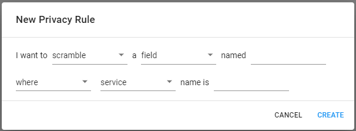

# Data Privacy

You can configure a Data Privacy policy on Aspecto to keep your sensitive data private, while Aspecto collects information from your applications.

In this policy, you can create rules to hide specific data fields in data involved in flows, or specific segments in flows.

## Data Privacy Rules

For data fields, you can set the rule to block the field, so it is not collected in Aspecto telemetry data, and is not shown  in Aspecto visualizations \(and cannot then be used as search text\). Or, you can include the field, but obfuscate \(scramble\) the field data. For example, a key value or user name can appear in the Live Flows,  but the actual data would be obfuscated.

For flow segments, you can set the rule to block collection of telemetry data for a flow segment in a service  All flows that include the segment will be excluded from telemetry data, and will not appear in the Live Flows.

## Create a rule

Click _Settings_, in the lower left of the Aspecto app, and then select _Data Privacy_. The rules you have created are listed. You can search them for specific rules based on text in the rule \(for example the name of a field or segment\).

1. Click _NEW RULE._     
2. Select whether the rule will apply to a data field or a flow segment
3. Select whether the rule will block collection of data for the item or, for data fields, permit data collection,  but scramble the data.
4. Select the name of the field or flow. For example, _/user/profile._
5. Then, select the specific service or flow in which it occurs, or anywhere \(all services or flows\)
6. Click _CREATE_, to add the rule.

Once created,  the rule will applied to all data collected after this \(but not to data already collected\).

 

