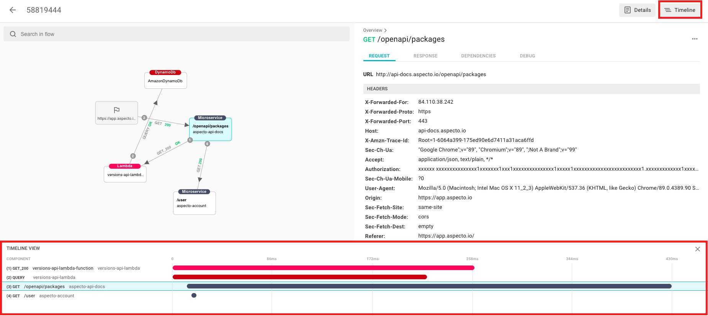

# Debug Performance Issues

Using Aspecto, you can see the exact timing of a data flow. This can give you insights into delays and possible bottlenecks in your applications and their flows.

Once you have selected a flow to investigate, click _Timeline_ in the information pane on the right.

The timeline for the flow is now shown, with the selected node highlighted. In the timeline window, you can see how many milliseconds each operation took, and get a clear picture of the sequence of operations, in order to optimize a specific flow. 

