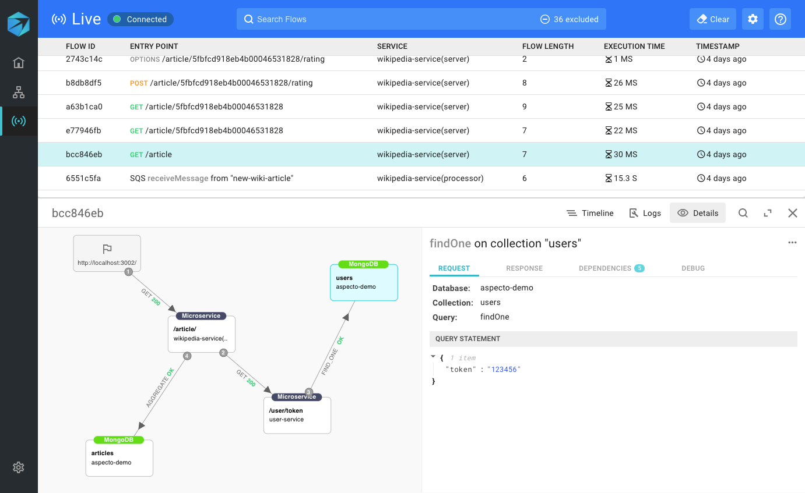

# Troubleshoot Local Environment

Visualizing your application's flows is a powerful way to deeply understand and debug your microservices. 

The example below shows a flow starting with an API request to the 'wikipedia-service' microservice, which calls 'user-service', and then saves data to the MongoDB database.

Clicking on a component, such as the 'wikipedia-service' component, highlighted in blue, shows details of the HTTP request and response on the right:

To visualize the next part of the flow, we'll click on the next component in the flow, 'user-service'.

The next step in the flow is an action on the MongoDB database, in this case, a _findOne_ operation.   
The query, along with other relevant data, such as the DB response, is shown on the right:

